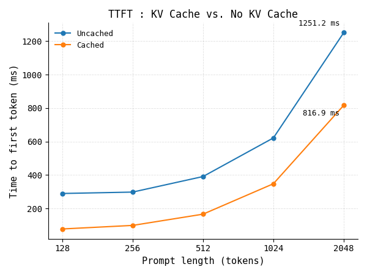
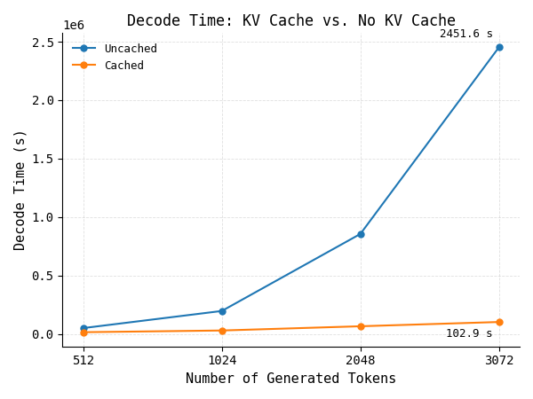
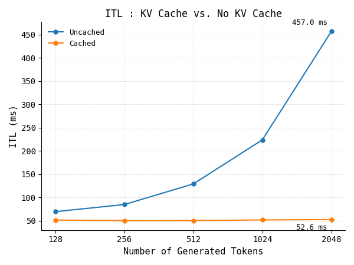
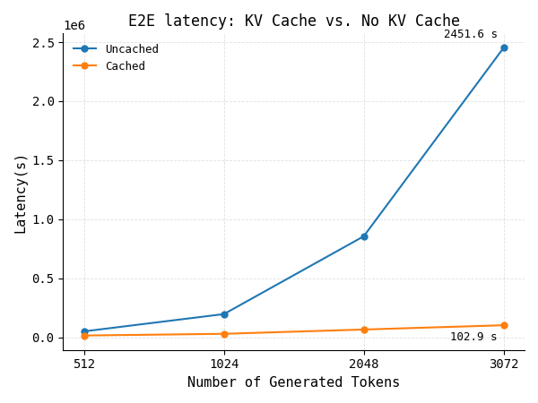
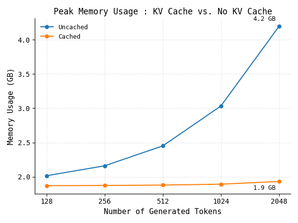

# Naive KV Cache for Qwen2.5-0.5B-Instruct

This project explores how a naive Key–Value (KV) cache changes LLM inference behavior in practice. It implements a lightweight, from-scratch cache on top of Qwen2.5-0.5B-Instruct and benchmarks the impact on latency and memory usage across different sequence lengths.

The goal is to understand the difference between:

- full recomputation of the attention history every step
- reusing previously computed keys and values with a KV cache

This is a hands-on implementation meant to make the internals of inference more transparent, beyond simply calling `model.generate()`.

## Overview

Large language models generate tokens autoregressively. During prefill, the model processes the full prompt once. During decode, it generates one token at a time. Without a KV cache, every new token requires recomputing attention over the entire previous sequence. With a cache, only the new token needs to be processed and the previous K/V states are reused.

This project measures:

- Prefill time
- TTFT (Time to First Token)
- Decode time
- Inter-Token Latency (ITL)
- End-to-end latency
- Peak memory usage
- Comparison of cached vs non-cached inference

## Why KV cache matters

The KV cache is crucial for efficient decoding because it avoids redundant computation.

Without caching:

- the model recomputes keys and values for the full history at each step
- attention work grows over the entire sequence repeatedly
- decode latency becomes much worse as generation length increases

With caching:

- only the new token is projected into key/value space
- past K/V states are reused
- decoding becomes much more efficient at longer sequence lengths

## Project structure

- `model.py`: custom Qwen implementation and naive KV cache logic
- `inference.py`: inference entry point for loading weights and running generation
- `install_weights.py`: downloads and stores model weights locally
- `metrics/`: benchmark JSON outputs for cached and non-cached runs
- `metrics_images/`: plots generated from the benchmark data
- `qwen2.5-0.5b-Instruct/`: local model files
- `requirements.txt`: Python dependencies for this project

## Installation

1. Clone the repository.
2. Create a virtual environment.
3. Install dependencies:

```bash
pip install -r requirements.txt
```

## Running the project

### Download weights

```bash
python install_weights.py
```

### Run inference

```bash
python inference.py
```

The model supports a `use_cache` flag, which toggles between:

- cached generation
- non-cached generation

## Metrics and benchmark results

The benchmark compares inference with and without KV caching across prompt lengths and generation lengths.

| Metric | Description |
| --- | --- |
| Prefill time | Time to process the prompt before the first token is emitted |
| TTFT | Time to First Token, including prompt processing |
| Decode time | Total time spent generating the remaining sequence |
| ITL | Inter-Token Latency, average time per generated token |
| End-to-end latency | Total time from start of generation to final token |
| Peak memory usage | Memory footprint during generation |

### TTFT vs prompt length

This plot shows how the first-token latency changes as prompt length increases.



### Decode time vs number of tokens

This plot compares total decode time for cached vs non-cached decoding as generation length scales.



### Inter-token latency

This figure highlights how token-by-token latency evolves during generation.



### End-to-end latency

This benchmark captures total latency from the initial prompt to the end of generation.



### Memory usage

This plot compares the peak memory footprint of the cached and non-cached approaches.



### Apple MPS memory profile

This graph shows the memory behavior measured on a local Apple MPS device.


## Benchmark observations

The results show the expected trade-off:

- caching substantially reduces decode latency as token count grows
- TTFT is still dominated by prefill cost, which is required for the first output token
- memory usage grows with context length because cached K/V states must be stored
- the speedup becomes more pronounced for longer generation lengths

This makes the KV cache especially important in autoregressive decoding, where the model generates many tokens sequentially.

## Notes

This is intentionally a naive implementation:

- static cache sizing
- single prompt path
- no batching
- no advanced optimization tricks
- no production inference engine features

The purpose is educational: to make the mechanics of attention caching and generation latency tangible and measurable.

## References and inspiration

This work is based on the core principles behind efficient transformer inference:

- autoregressive decoding
- causal attention
- prefill vs decode phases
- reused K/V activations
- attention optimization for generation

## License

This project is for educational and research use. Please check the model license terms for Qwen2.5-0.5B-Instruct before using it in production or redistributed workflows.

---

A benchmarked implementation of a naive KV cache for Qwen2.5-0.5B-Instruct, focused on understanding the real inference trade-offs behind efficient decoding.