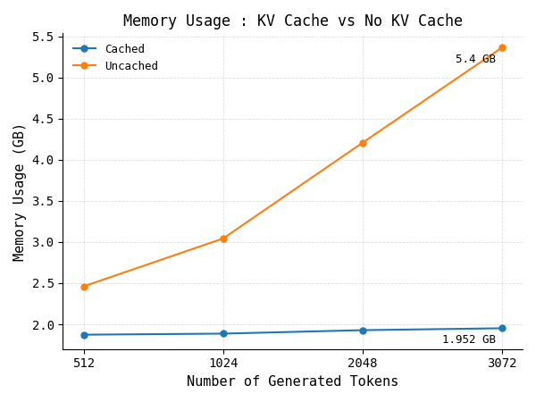

# Dynamic KV Cache for Qwen2.5-0.5B-Instruct

This project studies how a dynamic Key–Value (KV) cache affects LLM inference performance in practice. The implementation is built directly on top of Qwen2.5-0.5B-Instruct and adds a from-scratch caching layer that grows as generation length increases.

The goal is to compare:

- full recomputation of attention history on every decode step
- reusing previously computed keys and values through a cache
- the effect of dynamic cache resizing on latency and memory usage

This is still an educational implementation, but it is no longer a static fixed-size cache design.

## Overview

Autoregressive LLMs process the prompt once in the prefill phase and then generate tokens one-by-one during decoding. Without a KV cache, each new token forces the model to recompute attention over the entire previous sequence. With a cache, the model only needs to compute the current token and reuse the stored keys and values from earlier steps.

The current implementation adds a dynamic cache in `cache.py`:

- each layer keeps its own K/V buffers
- the cache grows when the sequence length exceeds capacity
- previously written values are preserved during resize
- cached states are reused during decode to avoid repeated full-history recomputation

## Why the dynamic KV cache matters

The KV cache reduces redundant work during generation, but real implementations also have to support longer sequences without preallocating too little memory.

Without caching:

- keys and values are recomputed for the entire prompt/history at every step
- attention cost grows substantially with generation length
- decode latency rises quickly as the sequence gets longer

With the dynamic cache:

- newly generated tokens are appended to the cache
- prior K/V states are reused across steps
- the underlying storage expands when needed instead of being permanently fixed at a small capacity
- longer generation runs become much more practical

## Project structure

- `cache.py`: dynamic per-layer K/V cache implementation with automatic resize logic
- `model.py`: Qwen model implementation and cached/non-cached generation paths
- `generation_model.py`: alternate generation flow for experimentation
- `inference.py`: lightweight example entry point for inference
- `server.py`: FastAPI service that runs cached generation
- `install_weights.py`: downloads and stores the local model weights
- `save_metrics.py`: captures latency and memory metrics to JSON files
- `metrics_new/`: generated benchmark JSON outputs for cached and non-cached runs
- `metrics_images/`: locally generated visualization plots when benchmarking is run
- `qwen2.5-0.5b-Instruct/`: downloaded model files and tokenizer assets
- `requirements.txt`: Python dependencies for the project

## Installation

1. Clone the repository.
2. Create and activate a virtual environment.
3. Install dependencies:

```bash
pip install -r requirements.txt
```

## Running the project

### Download weights

```bash
python install_weights.py
```

### Run inference

```bash
python inference.py
```

You can switch generation mode with the `use_cache` flag:

- `use_cache = False`: recompute the whole sequence every step
- `use_cache = True`: reuse the K/V cache across decoding steps

## Dynamic cache behavior

The cache logic lives in `cache.py` and is designed around dynamic growth rather than a fixed allocation.

At a high level:

- `LayerCache` stores K and V tensors for one transformer layer
- `seq_len` tracks the current logical sequence length
- when `seq_len >= capacity`, the backing tensor is resized and the existing values are copied over
- `KV_cache.update(...)` applies this logic for each layer during generation

This allows the model to handle longer sequences without needing to predefine a capacity that is too small for the task at hand.

## Metrics and benchmark results

The benchmark compares inference with and without the KV cache while tracking the same core metrics across prompt lengths and generation lengths.

| Metric | Description |
| --- | --- |
| Prefill time | Time needed to process the initial prompt before the first token is emitted |
| TTFT | Time to First Token, including prompt processing |
| Decode time | Total time spent generating the remaining tokens |
| ITL | Inter-token latency, or average time per generated token |
| End-to-end latency | Total time from generation start to final token |
| Peak memory usage | Maximum memory footprint during the run |

The exact charts can change as the benchmark scripts and model settings evolve. The project currently saves benchmark summaries as JSON under `metrics_new/`, and the generated plots are stored in `metrics_images/`.

### TTFT vs prompt length


### Decode time vs number of tokens


### Inter-token latency


### End-to-end latency


### Memory usage



## Benchmark observations

The expected behavior is consistent with efficient transformer decoding:

- caching substantially reduces decode latency as generation length grows
- TTFT is still dominated by the prefill cost of processing the prompt
- memory usage increases with context length because K/V states must be retained
- the benefit of caching becomes more visible for longer sequences and larger output lengths

This makes the dynamic cache especially important for autoregressive generation, where many tokens are produced sequentially.

## Notes

This project is intentionally lightweight and educational:

- it is a custom implementation rather than a production inference engine
- it does not include batching or advanced serving optimizations
- it focuses on making the mechanics of attention caching transparent and measurable

The main purpose is to make the trade-offs in attention reuse, sequence growth, and timing easy to observe in a runnable implementation.

## References and inspiration

This work follows the core ideas behind efficient transformer inference:

- autoregressive decoding
- causal attention
- prefill vs decode phases
- reused K/V activations
- attention optimization for generation

## License

This project is intended for educational and research use. Please check the model license terms for Qwen2.5-0.5B-Instruct before using it in production or redistributed workflows.

---

A dynamic, from-scratch KV cache for Qwen2.5-0.5B-Instruct, focused on understanding the real inference trade-offs behind efficient decoding and cache resizing.